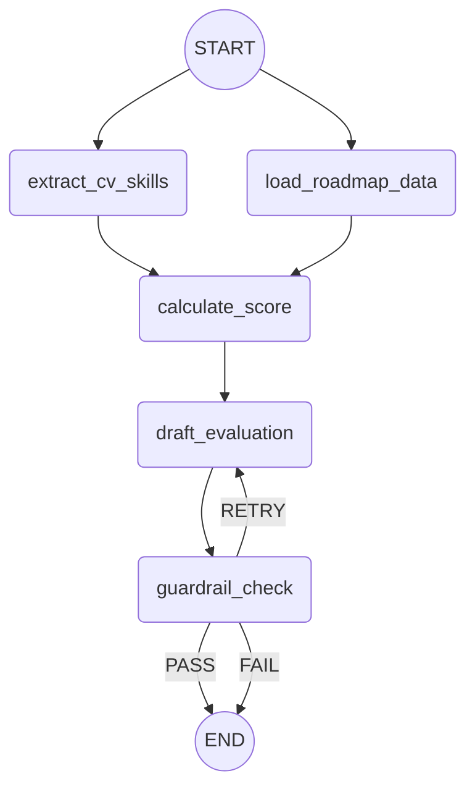

# Skill Path

Application Python modulaire pour evaluer un CV PDF contre une roadmap JSON avec **LangChain**, **OpenRouter** et **LangGraph**.

## Fonctionnalites

- Chargement d'un CV PDF depose dans le projet.
- Pipeline RAG local sur le CV avec chunking + retrieval BM25.
- Graphe LangGraph conforme au flux demande:
  - `extract_cv_skills`
  - `load_roadmap_data`
  - `calculate_score`
  - `draft_evaluation`
  - `guardrail_check`
- Extraction structuree des competences **et** experiences.
- Scoring deterministe: une notion est validee si **au moins une** techno attendue est retrouvee.
- Rapport final redige en francais avec boucle de revision guardrail.

## Arborescence

```text
src/skill_path/
  config.py
  graph.py
  main.py
  prompts.py
  schemas.py
  state.py
  nodes/
  services/
data/
  cv/
  roadmaps/
tests/
```

## Prerequis

- Python 3.11+
- Une cle OpenRouter
- Un modele compatible chat/structured output sur OpenRouter

## Installation

```powershell
python -m venv .venv
.venv\Scripts\Activate.ps1
python -m pip install -e .[dev]
Copy-Item .env.example .env
```

Renseigne ensuite `.env`:

```env
OPENROUTER_API_KEY=<your-openrouter-key>
OPENROUTER_MODEL=openai/gpt-4.1-mini
```

## Lancer une evaluation

Depose ton CV dans `data\cv\` et ta roadmap dans `data\roadmaps\`, puis execute:

```powershell
.\.venv\Scripts\Activate.ps1
skill-path data\cv\mon-cv.pdf data\roadmaps\ma-roadmap.json
```

Avec export du rapport et de l'etat final:

```powershell
.\.venv\Scripts\Activate.ps1
skill-path data\cv\mon-cv.pdf data\roadmaps\ma-roadmap.json `
  --output report.md `
  --state-output evaluation-state.json
```

## Format attendu pour une roadmap

Chaque notion expose un nom et une liste de technologies equivalentes. Une seule techno retrouvee dans le CV suffit pour valider la notion.

```json
{
  "title": "Backend Python",
  "summary": "Roadmap d'evaluation backend orientee Python.",
  "notions": [
    {
      "name": "API Web",
      "description": "Savoir concevoir et exposer une API HTTP.",
      "technologies": ["FastAPI", "Django", "Flask"]
    },
    {
      "name": "Base de donnees relationnelle",
      "technologies": ["PostgreSQL", "MySQL", "SQLite"]
    }
  ]
}
```

Un exemple complet est disponible dans `data\roadmaps\example-roadmap.json`.

## Variables d'environnement

| Variable | Description | Defaut |
| --- | --- | --- |
| `OPENROUTER_API_KEY` | Cle API OpenRouter | Obligatoire |
| `OPENROUTER_MODEL` | Modele chat utilise pour extraction, rapport et guardrail | Obligatoire |
| `OPENROUTER_BASE_URL` | Base URL OpenRouter | `https://openrouter.ai/api/v1` |
| `OPENROUTER_SITE_URL` | URL envoyee dans les headers OpenRouter | `https://github.com/lucas-gtd/skill-path` |
| `OPENROUTER_APP_NAME` | Nom applicatif envoye dans les headers | `skill-path` |
| `SKILL_PATH_RAG_CHUNK_SIZE` | Taille des chunks du CV | `900` |
| `SKILL_PATH_RAG_CHUNK_OVERLAP` | Overlap entre chunks | `120` |
| `SKILL_PATH_RAG_TOP_K` | Nombre de chunks recuperes par requete | `6` |
| `SKILL_PATH_GUARDRAIL_MAX_REVISIONS` | Nombre max de revisions avant echec dur | `3` |

## Flux LangGraph



## Tests

```powershell
.\.venv\Scripts\Activate.ps1
python -m pytest
```
